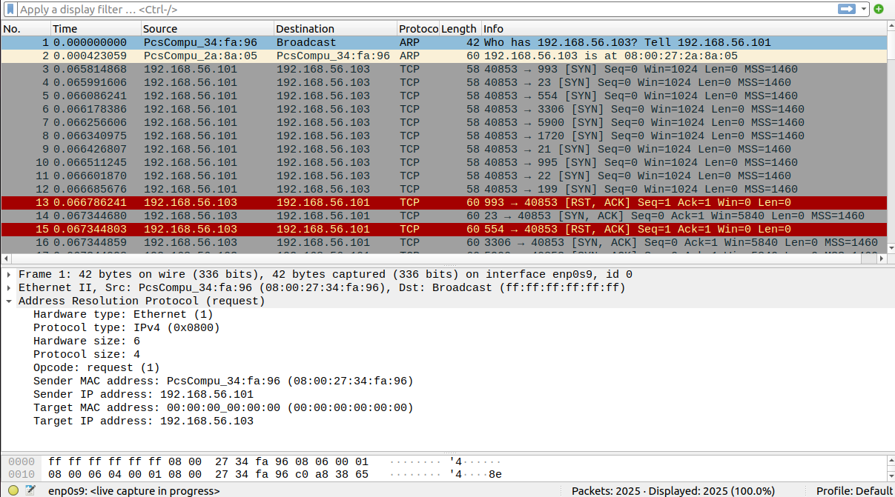
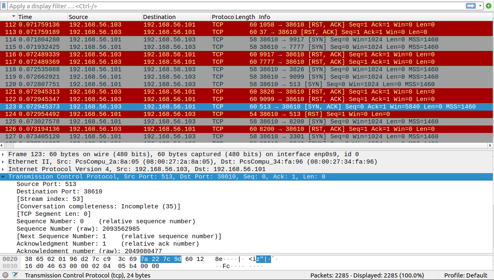
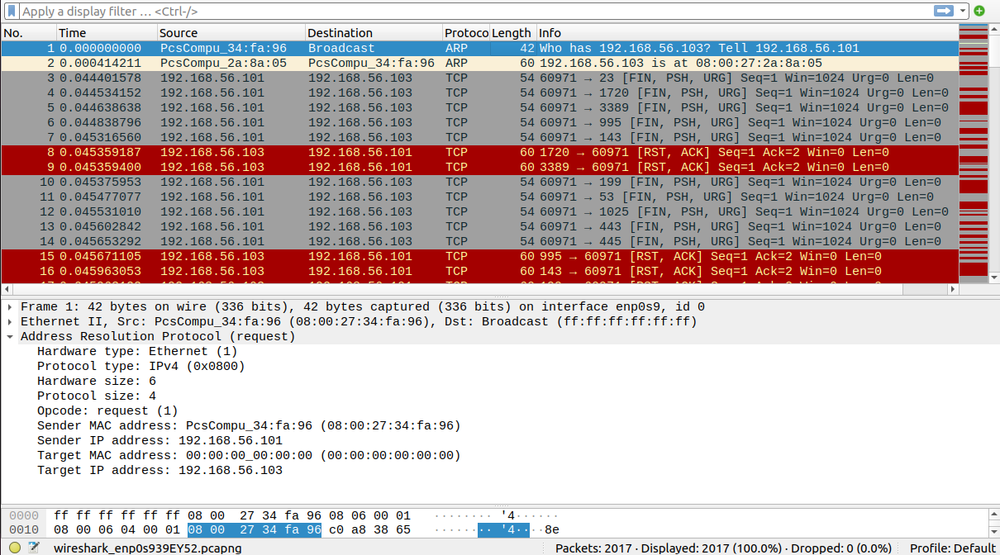
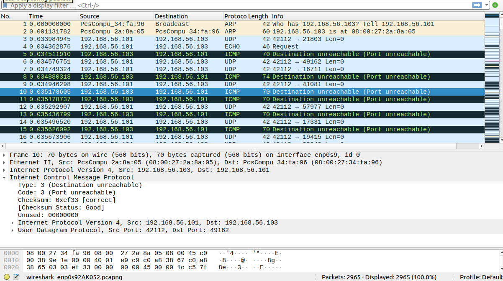

# Домашнее задание к занятию «Уязвимости и атаки на информационные системы» Федоров Дмитрий

### Инструкция по выполнению домашнего задания

1. Сделайте fork [репозитория c шаблоном решения](https://github.com/netology-code/sys-pattern-homework) к себе в Github и переименуйте его по названию или номеру занятия, например, https://github.com/имя-вашего-репозитория/gitlab-hw или https://github.com/имя-вашего-репозитория/8-03-hw).
2. Выполните клонирование этого репозитория к себе на ПК с помощью команды `git clone`.
3. Выполните домашнее задание и заполните у себя локально этот файл README.md:
   - впишите вверху название занятия и ваши фамилию и имя;
   - в каждом задании добавьте решение в требуемом виде: текст/код/скриншоты/ссылка;
   - для корректного добавления скриншотов воспользуйтесь инструкцией [«Как вставить скриншот в шаблон с решением»](https://github.com/netology-code/sys-pattern-homework/blob/main/screen-instruction.md);
   - при оформлении используйте возможности языка разметки md. Коротко об этом можно посмотреть в [инструкции по MarkDown](https://github.com/netology-code/sys-pattern-homework/blob/main/md-instruction.md).
4. После завершения работы над домашним заданием сделайте коммит (`git commit -m "comment"`) и отправьте его на Github (`git push origin`).
5. Для проверки домашнего задания преподавателем в личном кабинете прикрепите и отправьте ссылку на решение в виде md-файла в вашем Github.
6. Любые вопросы задавайте в чате учебной группы и/или в разделе «Вопросы по заданию» в личном кабинете.

Желаем успехов в выполнении домашнего задания.

------

### Задание 1

Скачайте и установите виртуальную машину Metasploitable: https://sourceforge.net/projects/metasploitable/.

Это типовая ОС для экспериментов в области информационной безопасности, с которой следует начать при анализе уязвимостей.

Просканируйте эту виртуальную машину, используя **nmap**.

Попробуйте найти уязвимости, которым подвержена эта виртуальная машина.

Сами уязвимости можно поискать на сайте https://www.exploit-db.com/.

Для этого нужно в поиске ввести название сетевой службы, обнаруженной на атакуемой машине, и выбрать подходящие по версии уязвимости.

Ответьте на следующие вопросы:

- Какие сетевые службы в ней разрешены?

Ответ

- Какие уязвимости были вами обнаружены? (список со ссылками: достаточно трёх уязвимостей)
  

Ответ

https://www.exploit-db.com/exploits/17491

https://www.exploit-db.com/exploits/37721

https://www.exploit-db.com/exploits/15449

---

### Задание 2

Проведите сканирование Metasploitable в режимах SYN, FIN, Xmas, UDP.

Запишите сеансы сканирования в Wireshark.

Ответьте на следующие вопросы:

- Чем отличаются эти режимы сканирования с точки зрения сетевого трафика?
- Как отвечает сервер?

*Приведите ответ в свободной форме.*

Ответ

nmap -sS — SYN-сканирование. Nmap отправляет на удалённый порт SYN-пакет и ожидает ответа. В зависимости от ответа определяется состояние порта. При этом полноценное соединение не устанавливается.

SYN метод, основанный на принципах создания TCP-соединения и состоящий в последовательной передаче на объект сканирования TCP SYN-запросов на создание соединения на различные порты. Если порт открыт, то на данный сканирующий запрос будет получен ответ TCP SYN АСК; если же порт закрыт - ответом будет TCP RST.

---
nmap -sF — FIN-сканирование. При таком типе сканирования устанавливается только TCP FIN бит.

FIN в основу данного метода легли некоторые тонкости реализации протокола TCP в различных сетевых ОС: на передаваемый TCP FIN-запрос закрытые порты отвечают пакетом с флагом RST, а открытые порты данное сообщение игнорируют. Однако сетевые ОС фирмы Microsoft таким методом просканировать не удастся, так как в их реализации протокола TCP передача пакета TCP RST в ответ на подобный запрос не предусмотрена.

---
nmap -sX — Xmas-сканирование. При этом типе сканирования устанавливаются FIN PSH и URG флаги, которые раскрашивают пакет

Xmas если в ответ приходит RST пакет, то порт считается закрытым, отсутствие ответа означает, что порт открыт|фильтруется. Порт помечается как фильтруется, если в ответ приходит ICMP ошибка о недостижимости (тип 3, код 1, 2, 3, 9, 10 или 13).

---
nmap -sU — UDP-сканирование. Nmap работает с протоколом UDP, отправляя UDP-пакеты на каждый целевой порт. Так как UDP не имеет механизма подтверждения получения, этот метод менее надёжен и может требовать больше времени для получения результатов. 

UDP сканирование работает путем посылки пустого (без данных) UDP заголовка на каждый целевой порт. Если в ответ приходит ICMP ошибка о недостижимости порта (тип 3, код 3), значит порт закрыт. Другие ICMP ошибки недостижимости (тип 3, коды 1, 2, 9, 10 или 13) указывают на то, что порт фильтруется. Иногда, служба будет отвечать UDP пакетом, указывая на то, что порт открыт. Если после нескольких попыток не было получено никакого ответа, то порт классифицируется как открыт|фильтруется. Это означает, что порт может быть открыт, или, возможно, пакетный фильтр блокирует его.

---
